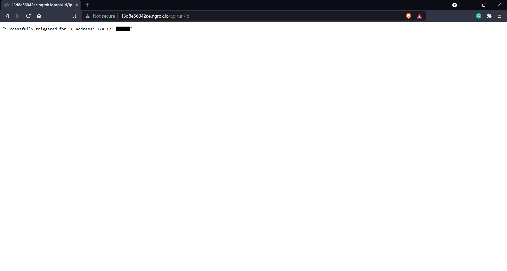
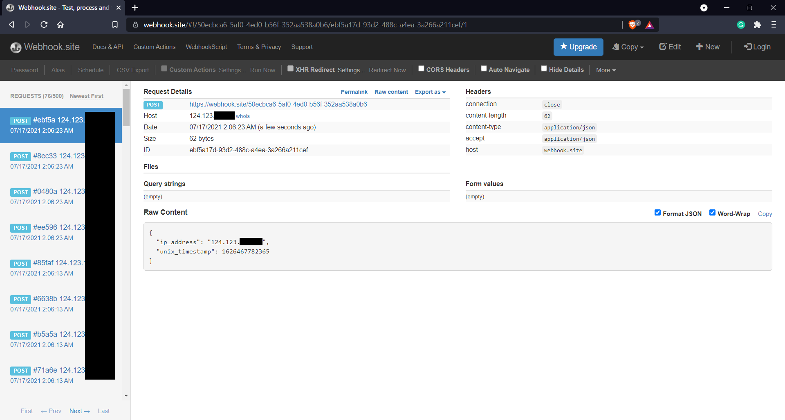
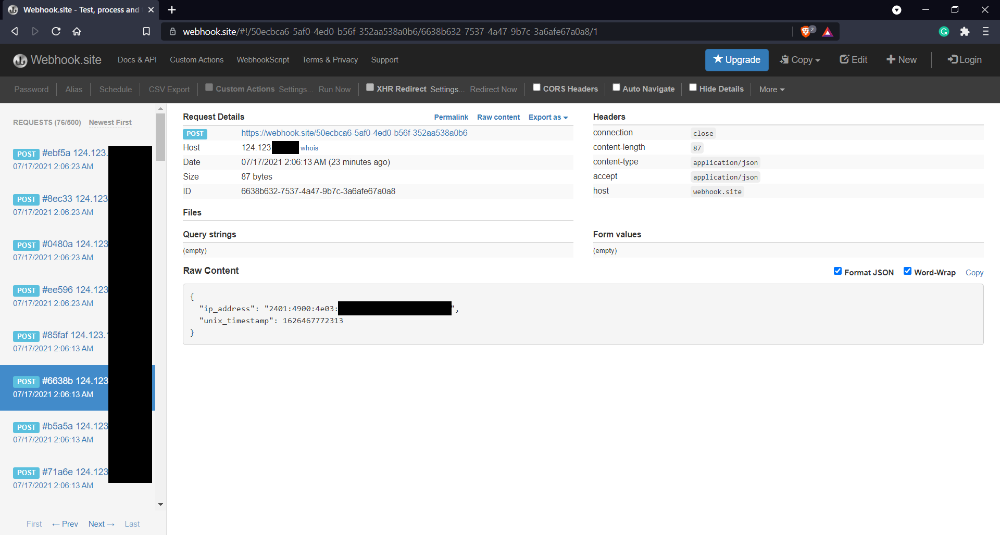
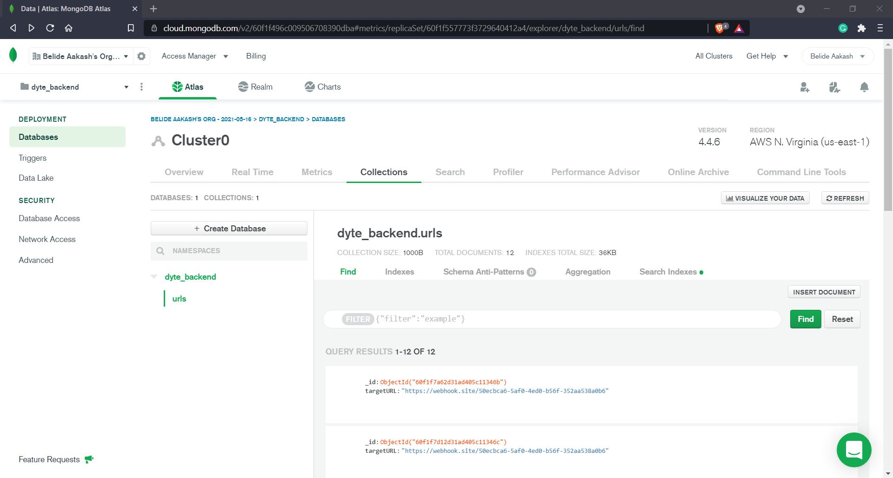

# dyte_backend
Webhooks microservices using molecular and express built for Dyte Placement task.

# Instructions
Routes and request types:
- http://localhost:3000/api/url/register - POST Request (Paramater: targetURL)
- http://localhost:3000/api/url/list - GET Request (Paramaters: - )
- http://localhost:3000/api/url/update - POST Request (Paramaters: id, targetURL)
- http://localhost:3000/api/url/delete - POST Request (Paramaters: id)
- http://localhost:3000/api/url/ip - GET Request (Paramaters: IP Address taken from users get request automatically)

Kindly use [POSTMAN](https://www.postman.com/) or [ThunderClient](https://www.thunderclient.io/) for testing the first four operations. You can use the same for the IP route as well but it might not find the IP address in the headers (x-forwarded-for). You can use ngrok and then use the external address.

## Commands
- `npm install`: To install all the required modules
- `npm run dev`: To start the application in development mode on http://localhost:3000
- `docker-compose up -d`: Start docker before running this command. The microservices are started along with NATS and Traefik
- `docker-compose logs`: To look at the logs

## Demo Screenshots
IP Response

Webhook listener

Webhook listener

MongoDB

MongoDB

# microservices 
This is a [Moleculer](https://moleculer.services/)-based microservices project. Generated with the [Moleculer CLI](https://moleculer.services/docs/0.14/moleculer-cli.html).

## Usage
Start the project with `npm run dev` command. 
After starting, open the http://localhost:3000/ URL in your browser. 
On the welcome page you can test the generated services via API Gateway and check the nodes & services.

In the terminal, try the following commands:
- `nodes` - List all connected nodes.
- `actions` - List all registered service actions.

## Services
- **api**: API Gateway services
- **url**: Service with `register`,`list`, `update`, `delete`, `trigger ip` actions.

## Useful links

* Moleculer website: https://moleculer.services/
* Moleculer Documentation: https://moleculer.services/docs/0.14/

## NPM scripts

- `npm run dev`: Start development mode (load all services locally with hot-reload & REPL)
- `npm run start`: Start production mode (set `SERVICES` env variable to load certain services)
- `npm run cli`: Start a CLI and connect to production. Don't forget to set production namespace with `--ns` argument in script
- `npm run ci`: Run continuous test mode with watching
- `npm test`: Run tests & generate coverage report
- `npm run dc:up`: Start the stack with Docker Compose
- `npm run dc:down`: Stop the stack with Docker Compose
